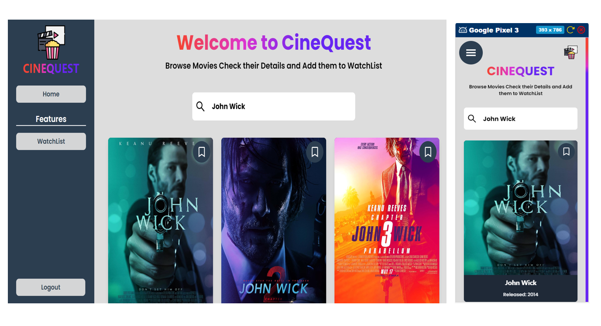

# Cine Quest - A Movie Search App


This is a Movie Search App for all the movie Lovers out their . On this app a user can search their favorite movies , check their details i.e Movie Plot , Relase Year , Cast and It's IMDB Rating .Apart from this the User can save their favorite movie on their personalized watchlist.

## Technologies Used
1) **React JS** - Frontend Library
2) **Tailwind** - CSS Utility Library
3) **Redux and Redux Toolkit** - State Management
4) **Axios** - Api Fetching Library
5) **Framer Motion**-React Animation Library
6) **React Icons** - Icons Library
7) **OMDB API** - For Movie Search API

### Deployed Website Endpoint
Hit the Url to Visit The Cinequest
https://cinequest-rkum17.netlify.app/ 

### Cine Quest src Folder Structure

    .
    ├── assests                 # Folder containing Images 
    ├── components              # Folder Containing React Components
    ├── constants               # Folder Containing Constant File
    ├── data                    # Folder Containing Mock Data
    ├── helper                  # Folder Containing All the Helper functions
    ├── hooks                   # Folder Containing Custom Hooks
    └── lang                    # Folder Containing Language Files
    ├── pages                   # Folder Containing Pages Components
    ├── store                   # Folder Containing Redux and State Related Files
    └── utils                   # Folder Containing Util functions Files


## Installation
### Prerequisites
```bash
Node >= 18.2.0
```
## Executing
Download the Dependencies
```bash
npm install 
#or
yarn install
```

## Executing

To start the application in the terminal run the below command

Just run:

```bash
# To Run development Mode
npm run dev
# To Run Production Mode locally
npm run build 
```

Configuration files(Optional)
 **constants.js**
```bash
# Override this as per your Server Url
export const OMDB_API_URL=<OMDB API URL>
export const OMBD_API_KEY=<Your OMDB API KEY>
```` 

### Local Website Endpoint
Hit the Url to Start the frontend application locally on your machine
http://localhost:3000/login  


<!-- MARKDOWN LINKS & IMAGES -->
[cinequest-images]:public/assests/Images/cine-quest.png